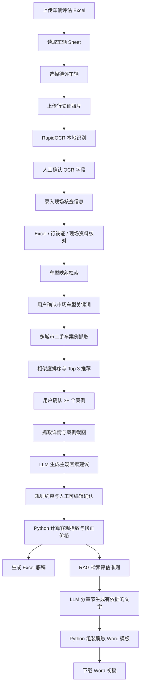

# Vehicle Valuation Agent

一个面向车辆市场法评估流程的 **Human-in-the-loop AI / RAG 工作流助手**。

项目从车辆评估明细表、行驶证照片和现场核查信息出发，完成资料核对、市场车型映射、二手车案例检索、案例差异修正、市场法测算，并生成可下载的 Excel 计算底稿与 Word 评估报告初稿。

> 本项目是学习与作品集项目，输出结果属于“待专业人员复核的初稿”，不构成正式资产评估报告、法律意见或交易报价。

## 目录

- [项目背景](#项目背景)
- [核心能力](#核心能力)
- [系统工作流](#系统工作流)
- [技术架构](#技术架构)
- [AI、RAG 与确定性计算的边界](#airag-与确定性计算的边界)
- [市场法计算逻辑](#市场法计算逻辑)
- [RAG 设计](#rag-设计)
- [项目结构](#项目结构)
- [快速开始](#快速开始)
- [端到端使用方法](#端到端使用方法)
- [Reproducibility：完整复现指南](#reproducibility完整复现指南)
- [测试与 RAG 评估](#测试与-rag-评估)
- [输入与输出](#输入与输出)
- [隐私与安全边界](#隐私与安全边界)
- [已知限制](#已知限制)
- [后续路线](#后续路线)
- [面试时如何介绍](#面试时如何介绍)

## 项目背景

车辆市场法评估通常包含多种重复且容易出错的工作：

1. 从甲方 Excel 明细表读取待评车辆资料；
2. 从行驶证照片中识别号牌、所有人、品牌型号、VIN 等信息；
3. 对 Excel、行驶证和现场核查结果进行一致性检查；
4. 把行驶证中的法定车型型号映射为二手车市场使用的车型名称；
5. 从公开二手车页面寻找至少 3 个相似案例；
6. 比较上牌时间、年均里程、车况等差异；
7. 生成修正指数、修正后价格和最终评估建议值；
8. 整理计算底稿、案例证据和评估报告初稿。

本项目的目标不是替代资产评估专业人员，而是把资料读取、证据收集、机械计算和初稿生成串成一条可追溯的工作流，让人工把时间集中在判断、复核和签字责任上。

## 核心能力

### 1. Excel 车辆明细读取

- 读取工作簿中的“车辆”Sheet；
- 支持同一张表包含多辆车；
- 解析资产编号、号牌、车型、生产厂家、购置日期、启用日期、累计里程和账面价值；
- 使用 Pydantic 对字段类型、非空值和账面价值关系进行校验。

### 2. 本地行驶证 OCR

- 使用 RapidOCR + ONNX Runtime 在本地识别行驶证；
- 提取号牌号码、所有人、住址、使用性质、车辆类型、品牌型号、VIN、发动机号、注册日期和发证日期；
- OCR 结果进入可编辑表单，用户确认后再进入后续流程；
- 不需要把行驶证上传到外部 OCR API。

### 3. 跨来源资料一致性检查

- 比较 Excel 与行驶证中的车牌号；
- 对品牌型号进行规范化后比较，降低空格、标点和“牌/小轿车”等表述差异造成的误报；
- 把不一致项作为提示展示，保留人工确认权。

### 4. 市场车型推荐与案例检索

- 根据法定型号检索本地公开车型映射资料；
- 推荐二手车市场常用车系和搜索关键词；
- 允许用户修改推荐关键词；
- 使用 Playwright 抓取公开二手车列表页和详情页；
- 根据车型关键词、上牌年份和里程计算相似度；
- 默认展示 Top 3，可继续添加更多案例；
- 保存车源链接、公开信息和案例页面截图。

### 5. AI 辅助差异判断

- 使用本地 Ollama `qwen3:8b`；
- 根据待评车辆与市场案例的现有证据生成结构化调整建议；
- 输出建议指数、理由、置信度和证据是否充分；
- 通过 Pydantic Schema 限制输出格式；
- `temperature=0`，降低同一输入下的随机波动；
- 资料不足时应回到 100（不调整），而不是编造差异。

### 6. 规则约束与确定性测算

- 外观、内饰、硬件等主观因素参考可配置规则；
- 年均行驶里程和上牌时间由 Python 公式计算；
- 用户可以修改 AI 建议值；
- 修正系数、修正后价格、平均值和最终建议值均由 Python 计算；
- 最终建议值按当前业务规则向下取整至百元。

### 7. Hybrid RAG 报告生成

- 解析 PDF / DOCX 资产评估准则；
- 按准则条款切分知识片段；
- 支持 BM25 关键词检索；
- 支持 `bge-m3` + FAISS 语义检索；
- 支持 Weighted Reciprocal Rank Fusion（加权 RRF）混合检索；
- 使用文档类型过滤减少跨章节误召回；
- 分章节调用本地 LLM，生成带 `chunk_id` 引用的内容；
- 验证引用必须来自本次检索证据；
- 最后由 Python 将事实字段、计算结果、RAG 章节和脱敏 Word 模板组装成 DOCX。

### 8. 可下载交付物

- `车辆评估结果.xlsx`
  - 原始车辆信息；
  - 市场法“计算表”；
  - 动态数量的“案例1、案例2……”Sheet；
  - 案例来源链接、车辆信息和网页截图；
  - AI 建议与公式计算结果的区分展示。
- `车辆评估报告初稿.docx`
  - 基于脱敏模板；
  - 包含车辆事实、评估结论、准则依据和市场案例；
  - 对缺失的正式业务信息保留“待补充”提示；
  - 清理空白编号、模板残留和旧目录页码。

## 系统工作流



## 技术架构

| 层级 | 技术 | 作用 |
|---|---|---|
| Web UI | Streamlit | 文件上传、表单确认、案例选择、结果下载 |
| 数据模型 | Pydantic v2 | 输入校验、结构化 LLM 输出、跨字段约束 |
| Excel | openpyxl | 读取原始明细表、写入计算表和案例 Sheet |
| OCR | RapidOCR + ONNX Runtime | 本地识别行驶证 |
| 网页自动化 | Playwright | 动态页面抓取与截图 |
| HTML 解析 | Beautiful Soup | 从列表页和详情页提取公开字段 |
| 本地 LLM | Ollama + `qwen3:8b` | 结构化调整建议、RAG 章节生成 |
| Embedding | Ollama + `bge-m3` | 将查询与知识片段转换为 1024 维向量 |
| 关键词检索 | jieba + rank-bm25 | 中文分词与 BM25 召回 |
| 向量检索 | FAISS `IndexFlatIP` | 对归一化向量进行余弦相似度检索 |
| 混合检索 | Weighted RRF | 融合 BM25 和 FAISS 的排名 |
| Word | python-docx | 事实替换、章节填充、格式清理和 DOCX 导出 |
| 测试 | pytest | 模型、公式、资料核对、导出校验与 RAG 指标测试 |

## AI、RAG 与确定性计算的边界

这是项目最重要的设计原则：**事实、计算、检索和生成不能混为一谈。**

| 内容 | 负责组件 | 是否允许模型自由生成 |
|---|---|---:|
| Excel 原始字段 | openpyxl + Pydantic | 否 |
| 行驶证文字 | OCR + 人工确认 | 否 |
| 现场车况等级 | 用户确认 | 否 |
| 市场案例价格、里程、年份、URL | 网页解析 | 否 |
| 年均里程、已使用年限 | Python 公式 | 否 |
| 修正系数、修正价格、平均值 | Python Decimal 计算 | 否 |
| 主观因素调整建议 | LLM + 规则 + 可编辑表格 | 可以建议，不可直接作为正式结论 |
| 评估准则证据 | RAG 检索 | 否，必须来自知识库 |
| 报告段落 | LLM 基于已检索证据生成 | 可以，但必须验证引用 |
| Word 模板与最终字段装配 | Python | 否 |

因此，本项目不是“让 LLM 从头算一个价格”，而是让 LLM 只处理适合语言模型的比较说明与初稿表达；数值计算和事实字段由程序控制。

## 市场法计算逻辑

### 1. 已使用年限

```text
已使用年限 = (评估基准日 - 注册日期) / 365
```

### 2. 年均行驶里程

```text
年均行驶里程 = 累计行驶里程 / 已使用年限
```

### 3. 条件指数

待评车辆的基准指数为 100。市场案例的条件相对待评车辆更好时，案例指数通常高于 100；更差时低于 100。主观因素使用业务规则规定的档差分值，客观因素使用 Python 公式。

当前客观公式为：

```text
案例年均里程指数
= 100 + (待评车辆年均里程 - 案例年均里程) / 600

案例上牌时间指数
= 100 + (案例注册日期 - 待评车辆注册日期) / 365 / 0.2
```

最终按 Excel 风格四舍五入为整数指数。

### 4. 修正系数

```text
某因素修正系数 = 100 / 案例该因素指数
```

### 5. 修正后价格

```text
修正后价格
= 案例公开价格 × 所有因素修正系数的连乘积
```

### 6. 最终建议值

```text
平均修正价格 = 所有案例修正后价格的算术平均值
最终建议值 = 平均修正价格向下取整至百元
```

代码使用 `Decimal`，避免金额计算直接依赖二进制浮点数。

## RAG 设计

### 1. 知识库

当前实验知识库由 10 份公开资产评估准则组成，元数据保存在：

```text
data/rag/sources.json
```

原始 PDF / DOCX 放在：

```text
data/rag/raw/
```

原始文档和处理后的索引默认被 `.gitignore` 排除，需要复现者根据 `sources.json` 自行准备公开文件。

### 2. 文档解析与切分

- PDF：`pypdf`；
- DOCX：`python-docx`；
- 切分策略：按“第 X 条”切分；
- 当前语料在本项目环境中生成 278 个知识片段；
- 每个片段保存：
  - `chunk_id`；
  - `document_id`；
  - 标题；
  - 文档类型；
  - 来源 URL；
  - 正文。

### 3. BM25 检索

BM25 使用 jieba 对中文查询和片段分词，适合查找“市场法”“特别事项说明”等明确术语。

### 4. FAISS 语义检索

`bge-m3` 将查询和文本转换为 1024 维向量。写入 FAISS 前执行 L2 归一化，然后使用 `IndexFlatIP` 计算内积：

```text
归一化向量内积 = cosine similarity
```

所以这里使用的是余弦相似度，而不是欧氏距离。

### 5. Weighted Hybrid RRF

BM25 分数与余弦相似度的量纲不同，因此不直接相加，而是融合两套排名：

```text
RRF 分数
= BM25权重 / (60 + BM25排名)
 + FAISS权重 / (60 + FAISS排名)
```

当前调参集选择的权重为：

```text
BM25 = 0.75
FAISS = 1.0
```

但独立测试中单独 FAISS 表现更好，因此生产服务默认使用 `faiss`，同时保留 `weighted_hybrid` 作为可评估、可切换的候选方案。这个结论来自实验，而不是预设“Hybrid 一定更好”。

### 6. 元数据过滤

不同报告章节只检索相关文档类型，例如：

- 评估方法：`评估方法`、`资产类别准则`；
- 价值类型：`指导意见`、`基本准则`；
- 评估程序：`程序准则`、`基本准则`；
- 特别事项：`报告准则`。

先限制主题范围，再从候选中取 Top-K，可以减少“语义相似但章节用途不正确”的证据。

### 7. Grounded Generation

LLM 接收的是：

1. 本章节的写作任务；
2. 检索到的 Top-K 片段；
3. 每个片段的 `chunk_id`；
4. “只能使用提供证据、不能编造条款”的约束。

生成后，程序检查 `cited_chunk_ids` 是否全部来自本次检索结果。完整报告采用“短章节生成 + Python 装配”，避免把整份长报告一次性塞给模型。

## 项目结构

```text
vehicle-valuation-agent/
├── app.py                              # Streamlit 主应用
├── pyproject.toml                      # 项目元数据与依赖
├── README.md
├── data/
│   ├── public/
│   │   ├── adjustment_rules.json       # 调整规则
│   │   ├── market_search_routes.json   # 市场搜索路由
│   │   └── vehicle_model_mappings.json # 法定型号到市场车型映射
│   ├── rag/
│   │   ├── sources.json                # RAG 文档元数据
│   │   ├── evaluation_questions.json   # 人工标注检索问题
│   │   ├── evaluation_results.json     # RAG 评估结果
│   │   ├── raw/                        # 原始准则，默认不提交 Git
│   │   └── processed/                  # chunks / FAISS 索引，默认不提交 Git
│   └── synthetic/                      # 合成测试数据
├── docs/
│   └── rag_evaluation.md               # RAG 实验说明
├── scripts/
│   └── evaluate_rag.py                 # 检索评估脚本
├── templates/
│   ├── vehicle_valuation_report_template.docx
│   └── vehicle_valuation_report_template.md
├── src/vehicle_valuation/
│   ├── model.py                        # Pydantic 领域模型
│   ├── excel_loader.py                 # Excel 读取
│   ├── license_ocr.py                  # OCR
│   ├── license_parser.py               # 行驶证字段解析
│   ├── checks.py                       # 跨来源一致性检查
│   ├── market_scraper.py               # 市场页面抓取、解析、截图
│   ├── model_mapping_retrieval.py       # 车型映射检索
│   ├── market_route_retrieval.py       # 搜索路由匹配
│   ├── adjustment_ai.py                # AI 调整建议
│   ├── adjustment_rules.py             # 调整规则读取
│   ├── adjustment_formulas.py          # 客观因素公式
│   ├── calculation.py                  # 修正价格和最终价值
│   ├── excel_exporter.py               # Excel 结果导出
│   ├── rag_ingestion.py                # RAG 文档解析与切分
│   ├── rag_retriever.py                # BM25 检索
│   ├── vector_retriever.py             # bge-m3 + FAISS
│   ├── hybrid_retriever.py             # Weighted RRF
│   ├── rag_service.py                   # RAG 统一服务
│   ├── rag_generation.py               # 有依据的章节生成
│   ├── report_evidence.py               # 报告证据检索
│   ├── report_section_generation.py     # 分章节生成
│   ├── report_assembly.py               # 报告事实组装
│   ├── docx_template.py                 # Word 模板操作
│   └── report_docx_exporter.py          # DOCX 导出
└── tests/                               # 单元与回归测试
```

## 快速开始

### 前置要求

- macOS / Linux（当前主要在 macOS 验证）；
- Python 3.11；
- Conda 或其他 Python 虚拟环境工具；
- Ollama；
- Chromium（由 Playwright 安装）；
- 可以访问待检索二手车网站的网络环境。

### 1. 获取项目

```bash
git clone <YOUR_REPOSITORY_URL>
cd vehicle-valuation-agent
```

如果你已经有本地仓库，只需要进入项目目录。

### 2. 创建独立环境

```bash
conda create -n vehicle-valuation-agent python=3.11 -y
conda activate vehicle-valuation-agent
```

不建议直接使用 Conda `base`，因为 OCR、FAISS、Streamlit 和 Playwright 的依赖较多，独立环境更容易排查版本问题。

### 3. 安装 Python 依赖

```bash
python -m pip install --upgrade pip
python -m pip install -e ".[dev]"
```

如果本地网络导致隔离构建无法下载 `setuptools`，可以尝试：

```bash
python -m pip install -e ".[dev]" --no-build-isolation
```

### 4. 安装 Playwright 浏览器

```bash
python -m playwright install chromium
```

### 5. 检查 OCR

```bash
rapidocr check
```

首次使用时 RapidOCR 可能会下载 ONNX 模型。成功时应看到：

```text
Success! rapidocr is installed correctly!
```

### 6. 准备 Ollama 模型

安装并启动 Ollama 后执行：

```bash
ollama pull qwen3:8b
ollama pull bge-m3
```

确认模型可用：

```bash
ollama run qwen3:8b "只回答：模型运行成功"
```

默认服务地址：

```text
http://localhost:11434
```

### 7. 启动应用

```bash
streamlit run app.py
```

浏览器打开：

```text
http://localhost:8501
```

## 端到端使用方法

1. 上传包含“车辆”Sheet 的 `.xlsx` 车辆评估明细表；
2. 从下拉框选择一辆待评车辆；
3. 选择评估基准日；
4. 上传对应车辆的行驶证照片；
5. 点击“识别行驶证”；
6. 核对并修改 OCR 自动填写的字段；
7. 点击“确认行驶证信息”；
8. 填写现场核查日期、实际里程、外观、内饰、硬件等级和车辆能否正常启动/行驶；
9. 点击“确认现场核查并核对资料”；
10. 核对系统推荐的市场车系和交易车型关键词；
11. 点击“搜索市场案例”；
12. 从相似度排序结果中选择至少 3 个案例，需要时点击添加更多；
13. 点击“确认采用的市场案例”；
14. 系统读取案例详情并截图；
15. 点击“AI自动生成调整参数”；
16. 检查并按需修改 AI 建议；
17. 查看 Python 公式计算的客观指数、修正系数和最终建议值；
18. 点击“生成Excel结果”，下载 `车辆评估结果.xlsx`；
19. 点击“生成Word报告初稿”，下载 `车辆评估报告初稿.docx`。

## Reproducibility：完整复现指南

本项目包含三种不同程度的可复现性：

| 场景 | 可复现程度 | 原因 |
|---|---|---|
| 单元测试与合成数据计算 | 高 | 不依赖实时网页和模型生成 |
| RAG 检索评估 | 中高 | 固定语料、固定问题和固定 Embedding 模型时稳定 |
| 本地 LLM 文本生成 | 中 | `temperature=0` 降低随机性，但模型版本可能变化 |
| 实时二手车搜索与截图 | 低至中 | 车源、价格、网站 UI、反爬策略和网络状态会变化 |

因此，“复现项目功能”与“复现某一天完全相同的市场价格”是两件不同的事。

### A. 记录运行环境

建议在复现实验前保存以下信息：

```bash
python --version
python -m pip --version
python -m pip freeze > environment-freeze.txt
ollama --version
ollama list
```

当前项目的 `pyproject.toml` 使用最低版本约束，而不是精确锁定版本，所以默认提供的是**功能级复现**，不是字节级复现。若用于论文或正式基准实验，应保存 `environment-freeze.txt`，并记录 Ollama 模型摘要。

### B. 准备 RAG 原始语料

1. 根据 `data/rag/sources.json` 中的 `filename` 准备对应 PDF / DOCX；
2. 把文件放入 `data/rag/raw/`；
3. 文件名必须与 `sources.json` 完全一致；
4. 如添加新文档，需要同时添加唯一 `document_id`、标题、类型和来源 URL。

目录示例：

```text
data/rag/raw/
├── 资产评估基本准则.docx
├── 资产评估执业准则——资产评估方法.pdf
├── 资产评估执业准则——机器设备.pdf
└── ...
```

### C. 重建知识片段

在项目根目录运行：

```bash
python -c "from pathlib import Path; from vehicle_valuation.rag_ingestion import build_extracted_documents, build_article_chunks, write_chunks_jsonl; docs=build_extracted_documents(Path('data/rag/raw'), Path('data/rag/sources.json')); chunks=build_article_chunks(docs); write_chunks_jsonl(chunks, Path('data/rag/processed/chunks.jsonl')); print('文档数量：', len(docs)); print('片段数量：', len(chunks))"
```

使用当前 10 份语料时，预期结果为：

```text
文档数量： 10
片段数量： 278
```

如果片段数量不同，应检查：

- 下载的准则版本是否相同；
- PDF 是否能正常提取文字；
- 文件名是否匹配；
- 文档中的条款格式是否发生变化。

### D. 重建 FAISS 索引

确保 Ollama 已运行且安装 `bge-m3`：

```bash
python -c "from pathlib import Path; from vehicle_valuation.rag_retriever import load_chunks; from vehicle_valuation.vector_retriever import FAISSRetriever, OllamaEmbeddingProvider; chunks=load_chunks(Path('data/rag/processed/chunks.jsonl')); retriever=FAISSRetriever(chunks, OllamaEmbeddingProvider(), index_path=Path('data/rag/processed/faiss.index')); print('索引条数：', retriever.index.ntotal)"
```

预期结果：

```text
索引条数： 278
```

索引存在时会直接读取；删除 `faiss.index` 后再次运行会重新生成。

> `chunks.jsonl` 发生变化后必须重建索引。程序会检查索引条数，但不会自动判断片段正文是否变化。

### E. 运行全部测试

```bash
python -m pytest -q
```

当前仓库预期：

```text
29 passed
```

测试覆盖：

- Pydantic 领域模型；
- 账面价值跨字段校验；
- 市场案例数量和价格约束；
- 车牌号与车型一致性检查；
- 市场法计算；
- 计算请求中的 `case_id` 一致性；
- Word 模板替换与空编号清理；
- Excel / Word 导出残留校验；
- RAG 指标计算与数据集格式。

### F. 复现 RAG 评估

```bash
python scripts/evaluate_rag.py
```

该脚本会：

1. 读取 15 个人工标注问题；
2. 使用 10 个 tuning 问题选择 RRF 权重；
3. 使用 5 个独立 test 问题比较 BM25、FAISS 和 Weighted Hybrid RRF；
4. 计算 Hit@3、Mean Recall@3 和 MRR@3；
5. 覆盖写入 `data/rag/evaluation_results.json`。

使用当前语料、问题和模型时，预期独立测试结果为：

| Retriever | Hit@3 | Mean Recall@3 | MRR@3 |
|---|---:|---:|---:|
| BM25 | 60.0% | 60.0% | 0.600 |
| FAISS | 100.0% | 100.0% | 0.867 |
| Weighted Hybrid RRF | 80.0% | 80.0% | 0.700 |

详细实验说明见 `docs/rag_evaluation.md`。

### G. 复现一个 RAG 查询

```bash
python -c "from pathlib import Path; from vehicle_valuation.rag_service import VehicleValuationRAG; rag=VehicleValuationRAG(Path('data/rag/processed/chunks.jsonl'), Path('data/rag/processed/faiss.index')); results=rag.retrieve('车辆市场法如何选择可比案例并修正差异', {'评估方法', '资产类别准则'}, top_k=3); [print(x['chunk_id'], x['title'], x['content'][:120]) for x in results]"
```

如果要测试混合检索，将构造函数改为：

```python
rag = VehicleValuationRAG(
    Path("data/rag/processed/chunks.jsonl"),
    Path("data/rag/processed/faiss.index"),
    retrieval_strategy="weighted_hybrid",
)
```

### H. 复现完整应用

完整 UI 流程还需要：

- 一份符合格式的车辆评估 Excel；
- 对应车辆的行驶证照片；
- 可访问二手车网站的网络；
- 正常运行的 Ollama；
- 已准备的 RAG 语料和索引。

为了保护真实客户信息，这些业务输入不放入公开仓库。`data/synthetic/` 只用于模型和计算测试，不等同于可直接上传到 Streamlit 的完整 Excel。

### I. 可复现性检查清单

- [ ] Python 为 3.11；
- [ ] 已进入独立虚拟环境；
- [ ] `python -m pip install -e ".[dev]"` 成功；
- [ ] `python -m playwright install chromium` 成功；
- [ ] `rapidocr check` 成功；
- [ ] `ollama list` 中存在 `qwen3:8b` 与 `bge-m3`；
- [ ] `data/rag/raw/` 中的文件与 `sources.json` 匹配；
- [ ] `chunks.jsonl` 为 278 条；
- [ ] FAISS 索引为 278 条；
- [ ] `python -m pytest -q` 全部通过；
- [ ] `python scripts/evaluate_rag.py` 生成评估结果；
- [ ] `streamlit run app.py` 可以打开页面；
- [ ] Excel 与 Word 下载文件能够正常打开；
- [ ] Word 中没有 `{{PLACEHOLDER}}`、旧客户名称或空白编号残留；
- [ ] Excel 中没有 `#REF!`，案例数量与选择数量一致。

## 测试与 RAG 评估

### 常规测试

```bash
python -m pytest -v
```

单独运行某个测试文件：

```bash
python -m pytest tests/test_model.py -v
python -m pytest tests/test_calculation.py -v
python -m pytest tests/test_docx_template.py -v
python -m pytest tests/test_rag_evaluation.py -v
```

### 检索指标含义

- **Hit@3**：Top 3 中至少出现一个正确片段的问题比例；
- **Mean Recall@3**：每个问题的正确片段在 Top 3 中被召回的比例，再取平均；
- **MRR@3**：第一个正确片段排名倒数的平均值，越接近 1 越好。

### 如何理解当前结果

- 评估集规模很小，只能作为项目基线；
- 调参集与测试集已经分开，避免直接在测试问题上选权重；
- FAISS 在当前 5 个测试问题上最好；
- Hybrid 能展示工程上完整的混合检索能力，但不能因为技术更复杂就默认优于单路检索；
- 后续若继续调参，必须新增未参与开发的测试问题，不能反复针对当前 5 个测试问题优化。

## 输入与输出

### 输入

#### 必需输入

- 车辆评估明细表 `.xlsx`；
- 评估基准日；
- 行驶证照片 `.jpg` / `.jpeg` / `.png`；
- 现场核查日期和实际里程；
- 外观、内饰、硬件等级；
- 是否能正常启动和行驶；
- 用户确认的 3 个或更多市场案例。

#### 由程序获取或生成

- 行驶证 OCR 字段；
- 市场车型推荐；
- 市场案例候选及相似度；
- 案例公开详情和网页截图；
- AI 主观因素建议；
- Python 客观因素指数；
- 修正后价格和最终评估建议值；
- RAG 准则证据和报告章节。

### 输出

#### Excel

```text
车辆评估结果.xlsx
```

包含原工作簿需要保留的内容、更新后的计算表、动态案例 Sheet、来源链接和网页截图。

#### Word

```text
车辆评估报告初稿.docx
```

包含脱敏模板结构、委托人和车辆事实、市场案例、评估方法、评估程序、特别事项、使用限制和评估结论。正式机构信息、报告编号、经济行为依据等无法从现有输入确定的内容会保留“待补充”。

## 隐私与安全边界

以下目录默认不会提交 Git：

```text
data/private/
references/private/
data/rag/raw/
data/rag/processed/
outputs/
tmp/
```

设计原则：

- 真实客户 Excel、行驶证和内部参考资料不得提交公开仓库；
- 行驶证 OCR 和 LLM 默认在本机执行；
- 项目不要求 OpenAI API Key；
- 网页抓取会访问外部二手车网站，因此车源请求本身不是离线操作；
- 报告模板必须先脱敏，不能保留原客户、机构和人员信息；
- 公开展示时应使用 `data/synthetic/` 或重新制作的演示资料。

## 已知限制

1. **实时市场页面不稳定**  
   二手车网站可能返回验证码、连接重置或安全验证，页面结构变化也会影响解析和截图。

2. **车源是动态数据**  
   同一查询在不同日期可能得到不同数量、价格和排序，无法保证完全复现历史市场结果。

3. **数据源覆盖有限**  
   当前主要实现瓜子二手车的公开页面流程，市场路由和车型映射仍是小规模知识库。

4. **公开详情可能不完整**  
   网站通常提供综合车况，但不一定分别披露外观、内饰、发动机、底盘和电气系统的完整检测信息。

5. **OCR 不是百分之百准确**  
   反光、模糊、遮挡和红框标注可能导致“牌”等字符误识别，因此必须保留人工确认。

6. **AI 只生成建议**  
   LLM 可能错误理解车况等级或给出方向不一致的理由。规则、结构化校验和人工复核不可省略。

7. **RAG 评估集较小**  
   当前只有 15 个问题，其中独立测试问题 5 个，指标不能代表所有实际查询。

8. **环境尚未完全锁定**  
   `pyproject.toml` 使用最低版本约束。不同日期安装的依赖和 Ollama 模型可能产生差异。

9. **不是正式评估系统**  
   项目没有机构签章、执业责任、完整业务约定和正式复核流程，生成结果只能作为初稿。

## 后续路线

### P0：交付稳定性

- 增加一个不依赖实时网站的完整演示 Excel 和脱敏行驶证；
- 保存经过授权的网页快照，支持离线回放测试；
- 为 Excel / DOCX 导出增加黄金文件回归测试；
- 增加依赖锁文件和模型版本清单；
- 为网站安全验证增加清晰的降级提示。

### P1：RAG 质量

- 扩充至 30–50 个全新测试问题；
- 增加无答案问题和拒答测试；
- 评估引用准确率、答案忠实度和上下文相关性；
- 对 BM25、FAISS、Hybrid 和可选 reranker 做统一离线评估；
- 给每个准则文档保存更精确的原始下载 URL 和版本日期。

### P2：Agent 工作流

- 将“案例不足 → 扩大城市 → 切换来源 → 再排序”封装为有状态工具调用；
- 设置最大尝试次数、超时和人工接管点；
- 记录每一步输入、输出、证据和失败原因；
- 保持所有外部操作可观察、可中断、可审计。

### P3：部署

- 将 Ollama Provider 抽象为本地模型 / 云端 Qwen API 可切换接口；
- 对上传文件做隔离存储和定期清理；
- 增加用户鉴权、任务状态、审计日志和敏感字段脱敏；
- 在遵守数据授权和网站条款的前提下部署给真实使用者。

## 面试时如何介绍

### 30 秒版本

> 我做了一个车辆市场法评估工作流助手。它能读取甲方 Excel，用本地 OCR 识别行驶证，核对资料后抓取并排序相似二手车案例，再让本地 Qwen 模型基于证据生成可编辑的调整建议。价格计算由 Python 完成。报告部分使用 10 份公开评估准则搭建 RAG，比较了 BM25、bge-m3 + FAISS 和加权 RRF，并用人工标注问题评估 Hit@3、Recall@3 和 MRR@3。最终系统可以下载带案例截图的 Excel 底稿和基于脱敏模板的 Word 初稿。

### 可以重点讨论的工程决策

- 为什么金额和修正系数不能交给 LLM 计算；
- 为什么使用 Pydantic 约束结构化输出；
- 为什么归一化向量 + `IndexFlatIP` 等价于余弦相似度；
- 为什么 BM25 与向量分数不直接相加，而使用 Weighted RRF；
- 为什么 Hybrid 必须经过评估，复杂不代表效果一定更好；
- 如何通过文档类型过滤减少错误条款；
- 如何防止 RAG 生成引用不存在的 `chunk_id`；
- 如何区分离线可复现测试与实时网页的不可控变化；
- 如何处理 OCR、网页反爬、缺失字段和模板残留。

---

如需将本项目用于真实业务，应由具备相应资质和责任的资产评估专业人员完成资料核验、方法复核、结论判断和正式签署。
