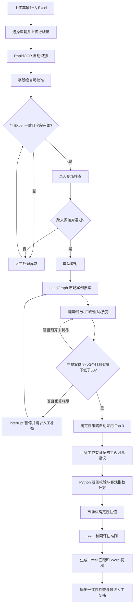

# Vehicle Valuation Agent

一个面向车辆市场法评估的本地 AI 工作流：自动读取 Excel 和行驶证、校准 OCR、核对资料，通过 LangGraph 搜索并筛选市场案例，使用确定性 Python 公式完成估值，再用有引用约束的 RAG 生成 Word 报告初稿。

这个项目不是“让大模型直接报一个价格”。核心设计是把不同风险的任务分开：LLM 负责理解和有依据的建议，Python 负责校验、门槛和计算，LangGraph 负责可恢复的搜索流程，人工只处理系统无法安全决定的异常和最终专业复核。

> 本项目是学习与作品集项目。输出属于待专业人员复核的初稿，不构成正式资产评估报告、法律意见或交易报价。

## 当前流程



更完整的节点、状态和职责图见 [docs/architecture.md](docs/architecture.md)。

## 主要能力

### 1. 自动资料读取与异常分流

- 读取含多辆车的 Excel“车辆”Sheet，并用 Pydantic 校验字段和账面价值关系；
- 上传行驶证后自动执行 RapidOCR，不需要再点击“识别”；
- 保留 OCR 原文、字段置信度和每次自动校准记录；
- 自动处理空格、分隔点、大小写、常见字母数字混淆以及有车型映射证据的品牌/法定型号轻微错误；
- 将校准结果直接与 Excel 比较，一致时自动进入下一步；
- 只有必填字段缺失、关键字段无法唯一校准或存在实质冲突时才显示人工编辑区。

例如 `梅赛德斯-奔驰界BJ7.204` 可以在法定型号与品牌证据唯一时自动校准为 `梅赛德斯-奔驰牌BJ7204`；无法由可信资料唯一还原的 VIN 或车牌冲突不会被模糊修正，而会升级人工处理。

### 2. LangGraph 市场案例搜索 Agent

项目只在市场案例搜索环节使用 Agent。它维护关键词、城市、来源、容差、重试预算、候选案例、拒绝原因和执行轨迹，并通过白名单工具完成：

- 首轮搜索；
- 案例质量评价；
- 自动扩展城市；
- 有限失败重试；
- 在上限内放宽年份或里程范围；
- 调整搜索关键词；
- 切换已配置的数据源；
- 达标后结束，或资源耗尽后安全暂停。

LangGraph 的实际价值不是替代 `if/else`，而是把分支、循环、状态、checkpoint、`interrupt` 和恢复统一成可测试的状态图。SQLite checkpoint 允许系统在案例不足时暂停，人工补充后从原状态继续，不重复已完成的城市搜索。

默认策略：

- 目标年份来自行驶证注册年份；
- 目标里程来自现场核查里程；
- 先搜索北京、上海，再扩展广州、深圳；
- 最多 8 轮；
- 质量分和年份/里程相似度都不得低于 60 分；
- 3 个完整合格案例满足门槛后，自动采用相似度最高的 Top 3；
- 只有案例不足、网页证据不完整或所有候选低于门槛时才人工介入。

详细设计见 [docs/agent_v1.md](docs/agent_v1.md)。

### 3. 受约束的 AI 建议与确定性估值

- 本地 Ollama `qwen3:8b` 只根据现有车辆与案例证据提出主观因素方向、档位差和理由；
- Pydantic 限制结构，证据不足时强制指数回到 100；
- 年均里程、上牌时间等客观指数由 Python 公式计算；
- 修正系数、修正后价格、平均值和最终建议值全部由 Python 计算；
- 异常建议才触发人工复核，最终金额不交给 LLM 计算。

### 4. Grounded RAG 报告

- 从 10 份公开资产评估准则构建知识库；
- 支持 BM25、`bge-m3 + FAISS` 和 Weighted RRF；
- 通过文档类型过滤限制不同报告章节的检索范围；
- LLM 只能引用本轮检索提供的 `chunk_id`；
- Python 校验引用存在性，并将车辆事实、计算结果、RAG 章节和脱敏模板组装成 DOCX。

RAG 只支持准则证据与报告文字，不参与车辆价格计算。

### 5. 可审计输出

- Excel 市场法计算底稿；
- 动态案例 Sheet、来源链接、详情字段和同次网页读取截图；
- Word 评估报告初稿；
- OCR 校准记录、Agent 执行轨迹和拒绝原因；
- 输出残留、案例数量、链接和金额一致性检查。

## 谁负责什么

| 环节 | LLM | Python / 规则 | 人工 |
|---|---|---|---|
| 行驶证处理 | 不负责 | OCR、字段校准、Schema 校验、跨来源比对 | 仅处理无法安全校准的异常 |
| 市场搜索 | 可作为 Planner 提议下一步 | LangGraph、白名单工具、预算、质量门槛、去重 | 仅在搜索不足或证据不完整时补充 |
| 案例采用 | 不负责 | 完整性检查、60 分硬下限、Top 3 排序 | 异常时选择或最终专业复核 |
| 调整因素 | 生成有证据的结构化建议 | 规则纠偏、证据不足回到 100、客观公式 | 处理异常建议 |
| 金额计算 | 不负责 | Decimal 公式、修正系数、取整 | 最终复核 |
| 报告 | 基于检索证据生成短章节 | 检索、引用校验、模板组装、输出校验 | 补充正式业务信息并签署 |

## 离线评测结果

运行：

```bash
python scripts/evaluate_workflow.py
```

脚本不访问二手车网站或 Ollama，使用合成异常和离线搜索后端测试确定性能力，并汇总仓库内已有的 RAG 独立测试结果。当前结果保存在 [data/evaluation/workflow_evaluation_results.json](data/evaluation/workflow_evaluation_results.json)。

### 资料校准与异常分流

| 指标 | 结果 |
|---|---:|
| 合成场景 | 8 |
| 可自动处理场景 | 5 |
| 可自动处理场景的关键字段正确率 | 100% |
| 常见 OCR 混淆自动校准成功率 | 100%（3/3） |
| 正常自动放行 / 异常人工分流准确率 | 100%（8/8） |
| 当前场景组合的自动通过率 | 62.5%（5/8） |

这里评测的是 **OCR 之后的字段校准与异常分流**，不是原始图片 OCR 准确率。62.5% 由本评测刻意放入 3 个异常场景得出，不能当作真实业务自动化率。

### LangGraph 搜索与自动选择

| 指标 | 结果 |
|---|---:|
| 离线搜索场景 | 5 |
| 可解场景搜索成功率 | 100%（3/3） |
| 可解场景自动 Top 3 就绪率 | 100%（3/3） |
| 成功场景平均搜索轮数 | 1.67 |
| 低于 60 分案例拦截率 | 100%（3/3） |
| 成功 / 暂停结果符合预期 | 100%（5/5） |

这组结果验证的是图路由、扩城、重试、暂停和硬门槛，不代表真实网站可用率。

### RAG 独立测试集

15 个标注问题中，10 个用于选择权重，5 个保留为独立测试：

| Retriever | Hit@3 | Mean Recall@3 | MRR@3 |
|---|---:|---:|---:|
| BM25 | 60.0% | 60.0% | 0.600 |
| FAISS | 100.0% | 100.0% | 0.867 |
| Weighted Hybrid RRF | 80.0% | 80.0% | 0.700 |

FAISS 在当前小型测试集上最好。项目保留 Hybrid 实现，但不会因为架构更复杂就宣称它一定更优。详细说明见 [docs/rag_evaluation.md](docs/rag_evaluation.md) 和 [docs/workflow_evaluation.md](docs/workflow_evaluation.md)。

## 技术栈

| 层 | 技术 | 用途 |
|---|---|---|
| UI | Streamlit | 文件上传、异常处理、结果展示与下载 |
| 数据模型 | Pydantic v2 | 输入、状态和 LLM 输出约束 |
| OCR | RapidOCR + ONNX Runtime | 本地行驶证识别 |
| Agent 编排 | LangGraph + SQLite checkpoint | 状态图、循环、暂停与恢复 |
| 网页读取 | Playwright + BeautifulSoup | 市场车源、详情与截图 |
| 本地模型 | Ollama + `qwen3:8b` | Planner、调整建议、报告章节 |
| 检索 | BM25 + `bge-m3` + FAISS + Weighted RRF | 准则证据召回 |
| 计算 | Python `Decimal` | 市场法公式与取整 |
| 文档 | openpyxl + python-docx | Excel 与 Word 输出 |
| 测试 | pytest | 单元、流程、checkpoint 与评测回归 |

## 项目结构

```text
vehicle-valuation-agent/
├── app.py
├── data/
│   ├── evaluation/workflow_evaluation_results.json
│   ├── public/                         # 车型映射、搜索路由、调整规则
│   ├── rag/                            # RAG 元数据、问题和评测结果
│   └── synthetic/                      # 合成测试数据
├── docs/
│   ├── architecture.md
│   ├── agent_v1.md
│   ├── rag_evaluation.md
│   └── workflow_evaluation.md
├── scripts/
│   ├── evaluate_rag.py
│   └── evaluate_workflow.py
├── src/vehicle_valuation/
│   ├── license_ocr.py
│   ├── license_calibration.py
│   ├── checks.py
│   ├── market_agent.py
│   ├── market_quality.py
│   ├── case_selection.py
│   ├── adjustment_ai.py
│   ├── adjustment_formulas.py
│   ├── calculation.py
│   ├── rag_service.py
│   ├── excel_exporter.py
│   ├── report_docx_exporter.py
│   ├── output_validation.py
│   └── workflow_evaluation.py
└── tests/
```

## 快速开始

要求：Python 3.11、Conda、Ollama，以及可供 Playwright 使用的 Chromium。

```bash
conda create -n vehicle-valuation-agent python=3.11 -y
conda activate vehicle-valuation-agent
python -m pip install -e ".[dev]"
python -m playwright install chromium
ollama pull qwen3:8b
ollama pull bge-m3
streamlit run app.py
```

不要在 Conda `base` 中运行本项目；OCR、FAISS、Streamlit 和 Playwright 的依赖应保存在独立环境。

### 运行测试

```bash
conda activate vehicle-valuation-agent
python -m pytest -q -p no:cacheprovider
```

### 运行评测

```bash
python scripts/evaluate_workflow.py
python scripts/evaluate_rag.py
```

`evaluate_workflow.py` 是完全离线的确定性流程基准。`evaluate_rag.py` 需要准备 RAG 语料、FAISS 索引和本地 `bge-m3`。

## 实际使用

1. 上传车辆评估 Excel，选择待评车辆和评估基准日；
2. 上传行驶证，系统自动 OCR、校准并与 Excel 对比；
3. 无异常时直接录入现场里程和车况；有异常时只修改被拦截字段；
4. 资料核对通过后，系统自动映射车型并运行市场搜索；
5. 3 个完整案例达到 60 分硬门槛时自动采用 Top 3；不足时通过 LangGraph `interrupt` 请求补充，随后从 checkpoint 恢复；
6. 系统生成调整建议，Python 完成客观指数、修正系数和金额计算；
7. 下载 Excel 计算底稿和 Word 报告初稿并进行最终专业复核。

## 隐私、安全与限制

- Excel、行驶证、OCR 和 LLM 默认留在本机；
- 真实客户文件、内部参考资料、RAG 原始文件、输出和临时文件不提交 Git；
- 网页搜索会访问外部二手车网站，实时车源、价格、验证码和页面结构不可控；
- OCR 自动修复必须有 Excel 或车型映射等可信证据，不能仅靠字符串相似度猜测关键字段；
- 60 分是最低相似度硬门槛，不保证案例在专业判断上必然可比；
- RAG 独立测试问题只有 5 个，当前指标是项目基线而不是普遍性能保证；
- LLM 只生成建议和有依据的文字，正式结论仍需评估专业人员复核与签署。
