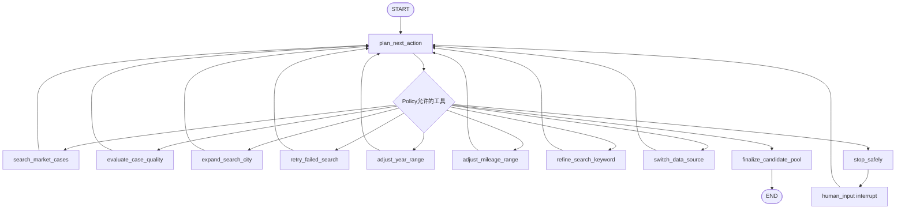

# LangGraph 市场案例搜索 Agent

项目只在市场案例搜索环节使用 Agent。资料校准、案例硬门槛、金额计算、RAG 引用校验和文档输出仍由确定性 Python 代码控制。

## 为什么使用 LangGraph

搜索不是一次函数调用，而是带循环和异常分支的有状态过程：首轮搜索可能不足，需要扩城；网页可能失败，需要有限重试；条件可能需要在上限内放宽；资源耗尽后要暂停；人工补充案例后还要从原状态继续。

LangGraph 把这些行为显式建模成状态图，并提供：

- 节点和条件边；
- 统一状态传递；
- SQLite checkpoint；
- `interrupt` 人工暂停；
- `Command(resume=...)` 恢复；
- 可生成的 Mermaid 执行图。

它并不消灭条件判断。Python 条件仍然负责业务规则，LangGraph 负责把这些规则组成可观察、可暂停和可恢复的长流程。

## 状态

`MarketAgentState` 持久记录：

- 市场关键词、目标年份和目标里程；
- 已搜索城市、来源和关键词；
- 年份/里程容差、轮次和重试预算；
- 全部车源、合格候选和拒绝原因；
- 详情字段、同次读取截图和网页失败记录；
- 当前状态、停止原因和完整工具轨迹；
- `graph_thread_id`，用于跨进程恢复 checkpoint。

## 节点与白名单工具



Planner 只能从当前 `allowed_tools` 选择下一步，不能传入任意 URL、Shell 命令或 Python 函数。LLM 不可用、输出不合法或越权时，系统降级到确定性 Planner 或由 Policy 替换为安全动作。

## 达标与人工介入

Python 对车型、年份、里程、字段完整度、详情页与截图、重复车源、价格异常和地区相关性评分。质量分和年份/里程相似度的硬下限都是 60 分。

- 至少 3 个完整案例达标：确定性策略自动采用相似度最高的 Top 3；
- 案例不足、网页证据不完整或候选都低于门槛：`stop_safely` 设置 `awaiting_human_input`，LangGraph `interrupt` 暂停；
- 人工补充案例：通过 `Command(resume=...)` 注入当前线程，继续质量评价，不重复之前的搜索；
- 再次不足：继续受轮次、工具和资源预算限制，不允许无限循环或降低 60 分底线。

## 可测试性

离线测试和评测使用模拟搜索后端，不访问真实网站，覆盖：

- 初始搜索成功；
- 案例不足后扩城；
- 城市失败后的有限重试；
- 60 分以下案例拦截；
- 资源耗尽后暂停；
- SQLite checkpoint 跨 Agent 实例恢复；
- 二进制截图在图状态序列化后仍被保留；
- Planner 越权动作被 Policy 拦截；
- 达标案例自动 Top 3。

运行：

```bash
python -m pytest tests/test_market_agent.py tests/test_workflow_evaluation.py -q
python scripts/evaluate_workflow.py
```
