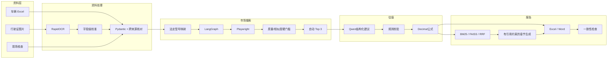
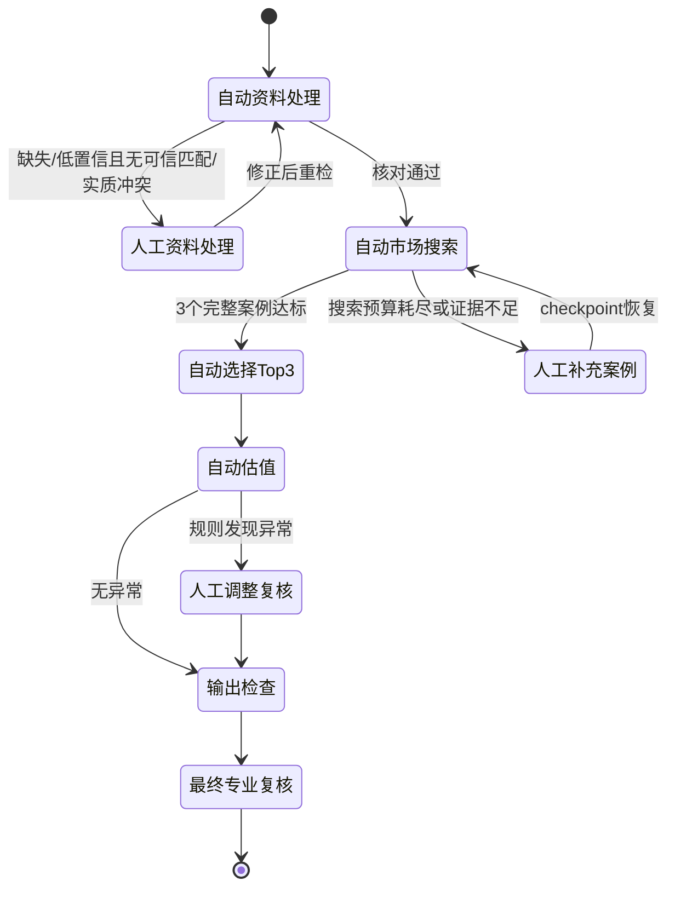

# 系统架构

## 总体架构



## 自动化与人工边界



人工介入不是固定步骤，而是异常分支。正常输入会自动完成 OCR 校准、资料比对、市场搜索和 Top 3 采用。

## LangGraph 内部职责

LangGraph 只编排市场搜索。`plan_next_action` 根据状态请求 Planner 提议动作，Policy 用 `allowed_tools` 和预算再次约束，工具节点执行确定性代码并更新 `MarketAgentState`。

```text
checkpoint state
      ↓
plan_next_action → Policy → one whitelisted tool
      ↑                         ↓
      └──────── updated state ──┘
                                ↓
              candidates_ready / interrupt / failed
```

关键状态：

| 状态 | 含义 | 下一步 |
|---|---|---|
| `running` | 仍有安全动作和预算 | 继续图循环 |
| `candidates_ready` | 至少 3 个候选通过硬门槛 | 自动完整性检查与 Top 3 |
| `awaiting_human_input` | 资源耗尽仍不足 | interrupt，等待补充 |
| `completed` | 案例已采用 | 进入调整与估值 |
| `failed` | 达到最大步骤或执行失败 | 安全停止并保留轨迹 |

## 确定性安全边界

以下行为不能由 LLM 绕过：

- 只能调用注册过的市场工具；
- 只搜索配置中的城市和数据源；
- 年份、里程、轮次和重试都有上限；
- 质量分和相似度不得低于 60；
- 案例必须有详情与同次读取截图；
- 金额与修正系数由 Python `Decimal` 计算；
- RAG 引用必须来自本轮召回的 `chunk_id`；
- 输出在下载前执行结构与残留检查。

## 可观测与恢复

- 每次工具调用记录动作、Planner 理由、Policy 说明、结果、候选数量和耗时；
- OCR 保存原文、字段置信度和校准规则；
- 被拒绝市场案例保存具体原因；
- SQLite 保存 LangGraph checkpoint；
- Excel 保留案例来源与截图，Word 保留检索证据形成的章节；
- 离线评测覆盖正常路径、异常路径、暂停和恢复。
